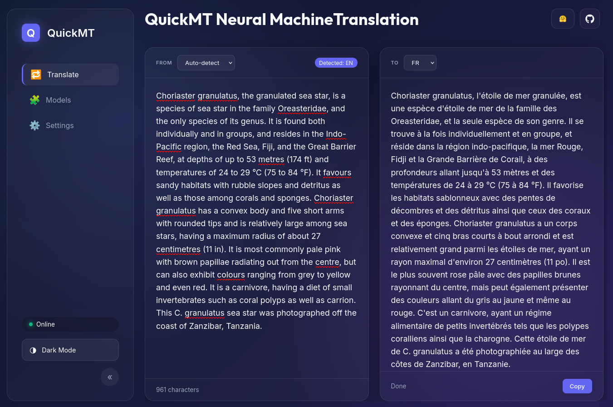

# `quickmt` Neural Machine Translation Inference Library


<a href="https://huggingface.co/spaces/quickmt/quickmt-gui"></a>


A reasonably quick and reasonably accurate neural machine translation (NMT) system. Models are trained using [eole](github.com/eole-nlp/eole) and inference using [ctranslate2](github.com/OpenNMT/CTranslate2) with [sentencepiece](github.com/google/sentencepiece) for tokenization.



## Why?

Ten out of the top twenty most downloaded machine translation (MT) models on Huggingface are Helsinki-NLP/opus-mt-xx-xx models. The French to English MT model was downloaded 820,000+ times in the past month. It is common to download pre-trained models from Huggingface and then fine-tune them to be better for specific tasks, but surely the majority of these downloads are people intending to use these models as-is rather than fine-tune them.

Our aim is to develop light-weight translation models that are faster *and more accurate* than the Opus-MT models, along with the bells and whistles to make these models useful (REST API, web application, sentence splitting, ...).

## Installation

We are not on pypi yet, but will be soon! In the meantime:

```bash
# Please use conda or a venv
git clone https://github.com/quickmt/quickmt.git
pip install ./quickmt
```

If you have trouble getting `quickmt` (`ctranslate2`) to detect your nvidia GPU, see the [CTranslate2 installation guide](https://opennmt.net/CTranslate2/installation.html). We suggest using conda and installing `cuda==12.8.0` into your conda environment before installing `quickmt`. 

Alternatively, you can use our Dockerfile if you're still having trouble getting it working:

```bash
docker build -t quickmt .
docker run -p 7860:7860 -ti --rm quickmt:latest
```

Then open your browser to http://localhost:7860.


## Web Application and REST Server

`quickmt` has a high-performance REST server and modern web interface for fast, accurate and private neural machine translation.

- **Language Detection**: Uses FastText if source language is not specified.
- **Automatic Model Downloading**: Automatically downloads models from Huggingface on first use.
- **Dynamic Batching**: Multiple concurrent HTTP requests are pooled together to maximize GPU utilization.
- **Multi-Model Support**: Requests are routed to specific models based on `src_lang` and `tgt_lang`.
- **LRU Cache**: Automatically loads and unloads models based on usage to manage memory.


To launch the web application and REST server:

```bash
quickmt-gui
```

The server will be available at http://localhost:8000 by default as port 8000 is the default port, and the API server is available at http://localhost:8000/docs. The following environment variables can be used to configure the server:

| Name | Default | Description |
| ---- | ------- | ----------- |
| `MAX_LOADED_MODELS` | 5 | Maximum number of models to keep loaded in memory (LRU eviction) |
| `MAX_BATCH_SIZE` | 32 | Maximum batch size for translation |
| `DEVICE` | 'auto' | Device to use for inference ('auto', 'cpu', or 'cuda') |
| `COMPUTE_TYPE` | 'default' | Compute type for translation ('auto', 'int8', 'float16', etc.) |
| `PORT` | 8000 | Port to use for the REST server |

See the "settings.py" file for all configuration options.


### API Usage

Basic API syntax: 

```bash
curl -X POST http://localhost:8000/api/translate \
     -H "Content-Type: application/json" \
     -d '{"src":"Hello world","src_lang":null,"tgt_lang":"fr","beam_size":2,"patience":1,"length_penalty":1,"coverage_penalty":0,"repetition_penalty":1}'
```

Returns:

```json
{
  "translation": "Bonjour tout le monde !",
  "src_lang": "en",
  "src_lang_score": 0.16532786190509796,
  "tgt_lang": "fr",
  "processing_time": 0.0006661415100097656,
  "model_used": "quickmt/quickmt-en-fr"
}
```


## Python Interface

```python
from quickmt import Translator

# Device is either 'auto', 'cpu' or 'cuda'
# Will download model from Huggingface if not already in your cache
t = Translator("quickmt/quickmt-fr-en", device="cpu")

# Translate - set beam size to 5 for higher quality (but slower speed)
t(["C'est la vie"], beam_size=1)
```
